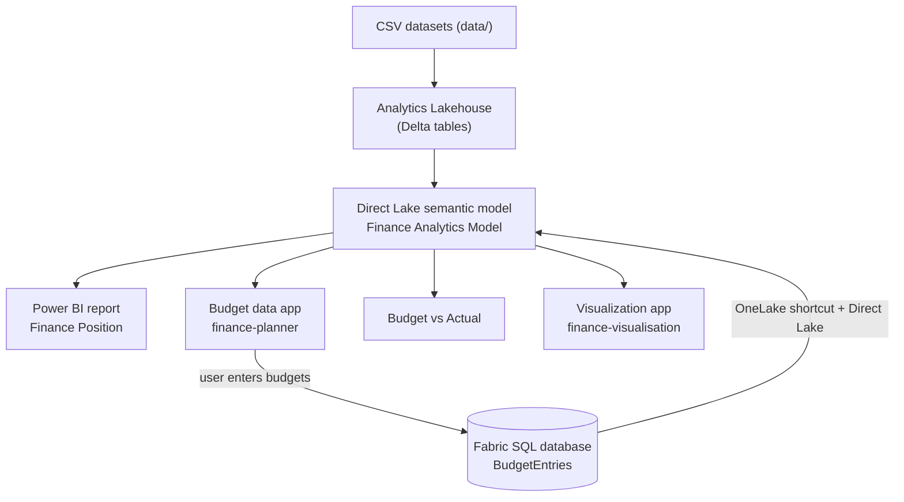

# Microsoft Fabric + Rayfin — Finance Planner

Build an **end-to-end finance analytics and planning solution on Microsoft Fabric** — and bring it together as two focused apps. You will load a synthetic finance dataset into a Lakehouse, model it as a **Direct Lake** semantic model, open the included **Finance Position** Power BI report, create a **Rayfin data app** for budget entry, feed those budgets back into Power BI, and then create a separate app for data visualization.

This repository contains the synthetic dataset, the finished app, the Power BI project, and a full, reproducible, **step-by-step** walkthrough so anyone can rebuild it on their own Fabric tenant.

### What you'll build

- An **`Analytics` Lakehouse** with a clean finance star schema (Delta tables).
- A **Direct Lake semantic model** (`Finance Analytics Model`) with relationships and DAX measures.
- One Power BI report — **Finance Position**.
- A budget-only **Rayfin data app** (`finance-planner`) hosted in Fabric for live data entry.
- A **Budget vs Actual** loop: budgets captured in the app flow back into the model via OneLake.
- A separate read-only Rayfin app (`finance-visualisation`) for analytics and visualization.

> **Demo capacity and storage-mode disclaimer.** This demo was built and run on an **F2 Fabric capacity**. Direct Lake is used here to demonstrate a low-latency OneLake-native pattern; it is not a universal recommendation. Assess **Import**, **DirectQuery**, **Direct Lake**, and, where appropriate, a **composite model** for each use case. The right choice depends on data volume, latency and freshness requirements, source capabilities, transformation needs, security, concurrency, performance, capacity, governance, and cost.

### What is Rayfin?

**Rayfin** is the CLI and framework for building **Microsoft Fabric data apps** — full-stack web apps that run inside the Fabric portal, backed by a Fabric-managed database and an auto-generated **GraphQL API**. You scaffold, run, and deploy with one tool (`npm create @microsoft/rayfin`, then `npx rayfin up`): you define entities and Rayfin generates the data layer and a type-safe client, so there's no hand-written SQL or GraphQL. ([Fabric data apps](https://learn.microsoft.com/en-us/fabric/apps/data-apps-template))

### Who this is for

Anyone comfortable with the basics of Fabric (Lakehouse, notebooks, semantic models) who wants a hands-on tour of Direct Lake modelling, Power BI, and Fabric data apps. Budget roughly **2–3 hours** end-to-end; every step is copy-paste runnable.

---

## Solution flow



---

## Table of contents

- [Prerequisites](#prerequisites)
- [Repository contents](#repository-contents)
- [Step 0 — Create the workspace, Lakehouse, and load the data](#step-0--create-the-workspace-lakehouse-and-load-the-data)
- [Step 1 — Prepare the finance fact table](#step-1--prepare-the-finance-fact-table)
- [Step 2 — Create the semantic model](#step-2--create-the-semantic-model)
- [Step 3 — Define the relationships](#step-3--define-the-relationships)
- [Step 4 — Clean up the semantic model](#step-4--clean-up-the-semantic-model)
- [Step 5 — Create the measures](#step-5--create-the-measures)
- [Step 6 — Open Finance Position and connect it to Fabric](#step-6--open-finance-position-and-connect-it-to-fabric)
- [Step 7 — Prepare Fabric Apps prerequisites](#step-7--prepare-fabric-apps-prerequisites)
- [Step 8 — Create the Rayfin data application](#step-8--create-the-rayfin-data-application)
- [Step 9 — Ask Copilot to build the budget-planning app](#step-9--ask-copilot-to-build-the-budget-planning-app)
- [Step 10 — Deploy the application to Fabric](#step-10--deploy-the-application-to-fabric)
- [Step 11 — Validate the budget-planning workflow](#step-11--validate-the-budget-planning-workflow)
- [Step 12 — Surface Budget vs Actual in Power BI](#step-12--surface-budget-vs-actual-in-power-bi)
- [Step 13 — Build the visualization-only app](#step-13--build-the-visualization-only-app)
- [Quick checklist](#quick-checklist)
- [References](#references)

---

## Prerequisites

- A **Microsoft Fabric** tenant with a workspace on Fabric capacity. This demo uses an **F2 SKU**; size production capacity for the expected workload.
- **Contributor**, **Member**, or **Admin** access to the workspace.
- Tenant settings enabled by a Fabric administrator:
  - **Fabric Apps** (data apps).
  - **Semantic Model Execute Queries REST API**.
- **Node.js** and **npm** installed locally (for the Rayfin CLI). Verify with `node -v` and `npm -v`.
- **Power BI Desktop** (optional, Windows) — only needed to open the included [`powerbi/`](powerbi) project.
- Basic familiarity with Fabric Lakehouse, notebooks, and Power BI semantic models.

### Get the code

Clone this repository so you have the dataset and reference artifacts locally:

```bash
git clone https://github.com/szenatti/presentations.git
cd presentations
cd "2026/Microsoft Fabric Rayfin"
```

---

## Repository contents

```
.
├── data/              # Synthetic finance dataset (CSV) — the starting point
├── finance-planner/   # The finished Rayfin data app (reference implementation)
├── finance-visualisation/ # Read-only Rayfin analytics app
├── powerbi/           # Power BI project (PBIP) for the Finance Position report
├── slide/             # Presentation slide deck (PDF)
└── README.md          # This walkthrough
```

The presentation slide deck is available as [Meetup - AMA and Microsoft Fabric Rayfin.pdf](slide/Meetup%20-%20AMA%20and%20Microsoft%20Fabric%20Rayfin.pdf).

> `finance-planner/`, `finance-visualisation/`, and `powerbi/` are the **finished** artifacts, included for reference — the steps below rebuild them from scratch so you learn each piece. The apps keep local secrets in their `.env.local` files, which are git-ignored; never commit tokens or connection strings.

All source data lives in the [`data/`](data) folder.

| File | Description |
| --- | --- |
| [FinanceActuals.csv](data/FinanceActuals.csv) | 6,000 finance transactions (1 Jan 2024 – 30 Jun 2026). Raw fact source. |
| [DimDepartment.csv](data/DimDepartment.csv) | 8 departments (`DepartmentKey`, `DepartmentName`, `BusinessUnit`, `BudgetOwner`). |
| [DimCategory.csv](data/DimCategory.csv) | 20 expense categories (`CategoryKey`, `CategoryName`, `ExpenseType`, `CategoryGroup`, `GLAccount`). |
| [DimVendor.csv](data/DimVendor.csv) | 35 vendors (`VendorKey`, `VendorName`, `VendorType`). |
| [DimRegion.csv](data/DimRegion.csv) | 5 Australian regions (`RegionKey`, `State`, `PrimaryCity`). |
| [DimProject.csv](data/DimProject.csv) | 8 projects (`ProjectKey`, `ProjectName`, `ProjectType`, `Status`). |
| [DimMonth.csv](data/DimMonth.csv) | Monthly date dimension (`MonthStart`, `CalendarYear`, `MonthNumber`, `MonthName`, `Quarter`, `FinancialYear`, `FinancialYearLabel`, `FinancialMonthNumber`). |
| [BudgetEntry_Schema.csv](data/BudgetEntry_Schema.csv) | Reference schema for the Rayfin-managed `BudgetEntry` entity (documentation only — not loaded into the model). |
| [README.txt](data/README.txt) | Dataset notes and built-in demonstration patterns. |

---

## Step 0 — Create the workspace, Lakehouse, and load the data

The remaining steps assume your Lakehouse already contains the dimension tables and `FinanceActuals`. Complete this step first.

1. In Fabric, create (or open) a workspace assigned to **Fabric capacity**.
2. Create a new **Lakehouse** named:

   ```
   Analytics
   ```

3. Upload the CSV files from [`data/`](data) into the Lakehouse **Files** area (drag-and-drop or **Get data → Upload files**):

   ```
   FinanceActuals.csv
   DimDepartment.csv
   DimCategory.csv
   DimVendor.csv
   DimRegion.csv
   DimProject.csv
   DimMonth.csv
   ```

4. Load each CSV into a **managed Delta table**. Open a notebook attached to the `Analytics` Lakehouse and run:

   ```python
   from pyspark.sql import functions as F

   files_to_tables = {
       "FinanceActuals": "Files/FinanceActuals.csv",
       "DimDepartment": "Files/DimDepartment.csv",
       "DimCategory": "Files/DimCategory.csv",
       "DimVendor": "Files/DimVendor.csv",
       "DimRegion": "Files/DimRegion.csv",
       "DimProject": "Files/DimProject.csv",
       "DimMonth": "Files/DimMonth.csv",
   }

   for table_name, path in files_to_tables.items():
       df = (
           spark.read
           .option("header", "true")
           .option("inferSchema", "true")
           .csv(path)
       )
       (
           df.write
           .format("delta")
           .mode("overwrite")
           .option("overwriteSchema", "true")
           .saveAsTable(table_name)
       )
       print("Loaded:", table_name, "Rows:", df.count())
   ```

   > Alternatively, right-click each uploaded CSV in the Lakehouse and choose **Load to Tables → New table**.

You now have seven managed tables in the `Analytics` Lakehouse.

---

## Step 1 — Prepare the finance fact table

`FinanceActuals` has a daily `TransactionDate`, while `DimMonth` has one record per month. Create a model-ready fact table with a matching `MonthStart` column.

In the `Analytics` Lakehouse, create a notebook and run:

```python
from pyspark.sql import functions as F

actuals = spark.table("FinanceActuals")

fact_finance_actuals = (
    actuals
    .withColumn(
        "TransactionDate",
        F.to_date(F.col("TransactionDate"))
    )
    .withColumn(
        "MonthStart",
        F.trunc(F.col("TransactionDate"), "month")
    )
)

(
    fact_finance_actuals.write
    .format("delta")
    .mode("overwrite")
    .option("overwriteSchema", "true")
    .saveAsTable("FactFinanceActuals")
)
```

This creates a clean fact table without changing your original uploaded table.

Confirm these data types:

| Column | Expected type |
| --- | --- |
| `TransactionDate` | Date |
| `MonthStart` | Date |
| `CalendarYear` | Integer |
| `MonthNumber` | Integer |
| `NetAmount_AUD` | Decimal or Double |
| `GST_AUD` | Decimal or Double |
| `GrossAmount_AUD` | Decimal or Double |
| Dimension keys | String |

Also verify that the dimension keys are unique:

```python
dimension_checks = {
    "DimDepartment": "DepartmentKey",
    "DimCategory": "CategoryKey",
    "DimVendor": "VendorKey",
    "DimRegion": "RegionKey",
    "DimProject": "ProjectKey",
    "DimMonth": "MonthStart"
}

for table_name, key_column in dimension_checks.items():
    total = spark.table(table_name).count()
    unique = (
        spark.table(table_name)
        .select(key_column)
        .distinct()
        .count()
    )

    print(
        table_name,
        "Rows:", total,
        "Unique keys:", unique,
        "Valid:", total == unique
    )
```

---

## Step 2 — Create the semantic model

Fabric no longer automatically creates a default semantic model when a Lakehouse is created, so you create one explicitly. A semantic model created from Lakehouse tables can use **Direct Lake**, reading the Delta tables directly from OneLake. ([Microsoft Learn](https://learn.microsoft.com/en-us/fabric/data-engineering/tutorial-lakehouse-build-report))

In Fabric:

1. Open the `Analytics` Lakehouse.
2. Switch from **Lakehouse** to **SQL analytics endpoint** using the selector in the upper-right area.
3. Select **New semantic model**.
4. Name it:

   ```
   Finance Analytics Model
   ```

5. Add these tables:

   ```
   FactFinanceActuals
   DimDepartment
   DimCategory
   DimVendor
   DimRegion
   DimProject
   DimMonth
   ```

Do **not** include:

```
FinanceActuals
BudgetEntry_Schema
```

`FinanceActuals` is your raw source table, and `BudgetEntry_Schema` is only documentation. The actual budget table will be created by Rayfin.

> If Fabric asks you to select a Direct Lake mode, the default option is sufficient for this demonstration. Fabric supports creating Direct Lake models from the Lakehouse or SQL analytics endpoint. ([Microsoft Learn](https://learn.microsoft.com/en-us/fabric/fundamentals/direct-lake-develop))

---

## Step 3 — Define the relationships

Open the semantic model, switch from **Viewing** to **Editing**, and create these relationships:

| From table and column | To table and column | Cardinality |
| --- | --- | --- |
| `FactFinanceActuals[DepartmentKey]` | `DimDepartment[DepartmentKey]` | Many-to-one |
| `FactFinanceActuals[CategoryKey]` | `DimCategory[CategoryKey]` | Many-to-one |
| `FactFinanceActuals[VendorKey]` | `DimVendor[VendorKey]` | Many-to-one |
| `FactFinanceActuals[RegionKey]` | `DimRegion[RegionKey]` | Many-to-one |
| `FactFinanceActuals[ProjectKey]` | `DimProject[ProjectKey]` | Many-to-one |
| `FactFinanceActuals[MonthStart]` | `DimMonth[MonthStart]` | Many-to-one |

For every relationship, use:

```
Cardinality: Many to one (*:1)
Cross-filter direction: Single
Active: Yes
```

The fact table should always be on the many side and the dimension table on the one side. Microsoft recommends single-direction, many-to-one relationships for this star-schema pattern. ([Microsoft Learn](https://learn.microsoft.com/en-us/fabric/data-engineering/tutorial-lakehouse-build-report))

Your model should resemble:

```
                   DimDepartment
                         │
DimVendor ─────── FactFinanceActuals ─────── DimCategory
                         │
                    DimMonth
                         │
              DimRegion / DimProject
```

---

## Step 4 — Clean up the semantic model

Hide the technical columns that report users do not need:

```
DepartmentKey
CategoryKey
VendorKey
RegionKey
ProjectKey
TransactionID
CalendarYear
MonthNumber
```

Keep the keys available for relationships but hidden from report view.

Set these formatting properties:

| Field | Format |
| --- | --- |
| `NetAmount_AUD` | Australian currency |
| `GST_AUD` | Australian currency |
| `GrossAmount_AUD` | Australian currency |
| `TransactionDate` | `dd mmm yyyy` |
| `MonthStart` | `mmm yyyy` |

Sort:

```
DimMonth[MonthName]
```

by:

```
DimMonth[MonthNumber]
```

Also sort `FinancialYearLabel` and `FinancialMonthNumber` appropriately if you intend to present by Australian financial year.

---

## Step 5 — Create the measures

Create a dedicated measure table named:

```
Finance Measures
```

Then add these measures.

### Actual amount

```dax
Actual Amount =
SUM(FactFinanceActuals[NetAmount_AUD])
```

### GST amount

```dax
GST Amount =
SUM(FactFinanceActuals[GST_AUD])
```

### Gross amount

```dax
Gross Amount =
SUM(FactFinanceActuals[GrossAmount_AUD])
```

### Transaction count

```dax
Transaction Count =
DISTINCTCOUNT(FactFinanceActuals[TransactionID])
```

### Average transaction

```dax
Average Transaction =
DIVIDE(
    [Actual Amount],
    [Transaction Count]
)
```

### Posted amount

```dax
Posted Amount =
CALCULATE(
    [Actual Amount],
    FactFinanceActuals[PostingStatus] = "Posted"
)
```

### Accrued amount

```dax
Accrued Amount =
CALCULATE(
    [Actual Amount],
    FactFinanceActuals[PostingStatus] = "Accrued"
)
```

### Pending amount

```dax
Pending Amount =
CALCULATE(
    [Actual Amount],
    FactFinanceActuals[PostingStatus] = "Pending"
)
```

### Previous-month actual

```dax
Previous Month Actual =
CALCULATE(
    [Actual Amount],
    DATEADD(
        DimMonth[MonthStart],
        -1,
        MONTH
    )
)
```

### Month-over-month change

```dax
Month-over-Month Change =
[Actual Amount] - [Previous Month Actual]
```

### Month-over-month percentage

```dax
Month-over-Month Change % =
DIVIDE(
    [Month-over-Month Change],
    [Previous Month Actual]
)
```

Format the amounts as:

```
$#,##0;($#,##0);-
```

Format percentages as:

```
0.0%;(0.0%);-
```

> Do **not** create the Budget or Variance measures yet. The initial budget will reside in the Rayfin-managed database, not in this semantic model — you bring it into the model later in [Step 12](#step-12--surface-budget-vs-actual-in-power-bi).

---

## Step 6 — Open Finance Position and connect it to Fabric

The repository already contains the only Power BI report required for this walkthrough: [`powerbi/FinancePosition.pbip`](powerbi/FinancePosition.pbip).

1. Open `FinancePosition.pbip` in Power BI Desktop.
2. Open **Transform data → Data source settings** and replace the sample/source connection with the SQL analytics endpoint for your `Analytics` Lakehouse, if prompted.
3. In the model or report connection settings, select the published `Finance Analytics Model` in your Fabric workspace.
4. Sign in with the account that has **Read** and **Build** permission on the semantic model.
5. Refresh the report and confirm that the Finance Position visuals display data from your Fabric workspace.
6. Save and publish the report back to the same workspace when required.

Do not create a separate validation report. Continue using **Finance Position** as the Power BI report throughout the remaining steps.

---

## Step 7 — Prepare Fabric Apps prerequisites

Before creating the application, verify:

- Fabric Apps is enabled in tenant settings.
- Your workspace is on Fabric capacity.
- You have Contributor, Member, or Admin access.
- The **Semantic Model Execute Queries REST API** tenant setting is enabled.
- You have **Build** and **Read** permission on `Finance Analytics Model`.
- Node.js and npm are installed locally.

The data-app template uses the semantic-model Execute DAX Queries capability and requires a model on Fabric or Power BI capacity, along with Build and Read permissions. ([Microsoft Learn](https://learn.microsoft.com/en-us/fabric/apps/data-apps-template))

---

## Step 8 — Create the Rayfin data application

Copy the URL shown in your browser while the semantic model is open. That URL contains the workspace and semantic-model identifiers needed by the data-app template.

Then run:

```bash
npm create @microsoft/rayfin@latest -- "finance-planner" \
  --template dataapp \
  --workspace "<your-workspace-name>"
```

Then:

```bash
cd finance-planner
npm run dev
```

The Rayfin CLI scaffolds the project, including frontend source code, backend configuration, and the `rayfin/data` model folder. The data-app template is currently created through the Rayfin CLI. ([Microsoft Learn](https://learn.microsoft.com/en-us/fabric/apps/data-apps-template))

---

## Step 9 — Ask Copilot to build the budget-planning app

Use this prompt (replace the placeholder with your semantic model URL):

```text
Build a budget-planning application using this Microsoft Fabric semantic model:

<PASTE SEMANTIC MODEL URL>

The semantic model is called Finance Analytics Model.

Create one page called Budget Planning with this purpose:

Plan budgets and track them against actual expenditure.

Do not add charts, KPI cards, or other visualizations.

Create a Rayfin entity called BudgetEntry with:

- id
- financialYear
- monthNumber
- budgetDate
- departmentKey
- categoryKey
- budgetAmount
- comment
- createdBy
- createdAt
- updatedAt

Set budgetDate to the first day of the selected calendar month and year.
The combination of financialYear, monthNumber, departmentKey, and categoryKey
represents one budget entry. Update an existing row for that combination rather
than creating a duplicate.

Add a form that lets the signed-in user select year, month, department, and cost
category; enter a budget amount and optional comment; and save or update the row.

Below the form, add a responsive table showing all previously entered budget
lines with Budget Date, Department, Category, Budget Amount, Actual Amount, and
Variance. Match Actual Amount from the semantic model at the same year, month,
department, and category grain. Use Australian currency formatting.

Do not create sample or hard-coded data.
Actual values and dimension labels must come from the connected semantic model.
```

The finished reference implementation is included in [`finance-planner/`](finance-planner).

---

## Step 10 — Deploy the application to Fabric

So far the app has run locally with `npm run dev` and rendered inside the Fabric portal through a temporary dev URL. To publish it as a **hosted Fabric app** — reachable by anyone with access to the workspace and no longer dependent on your local machine — deploy it with the Rayfin CLI.

This deployment publishes the **Budget Planning** page, provisions the managed SQL database, and applies the `BudgetEntry` schema.

### Prerequisites

These were verified in [Step 7](#step-7--prepare-fabric-apps-prerequisites):

- Fabric Apps is enabled in tenant settings.
- Your workspace is on Fabric capacity.
- You have Contributor, Member, or Admin access, plus **Build** and **Read** on `Finance Analytics Model`.

### Deploy

From the project root (`finance-planner`):

```bash
# 1. Sign in to Fabric with your Entra ID account
npx rayfin login

# 2. Build, deploy, and apply any pending schema changes — in one step
npx rayfin up

# 3. Verify the deployed endpoints are healthy
npx rayfin up status
```

`rayfin up` performs the full publish in a single command:

- Runs the static build (`npm run build:fabric`) and publishes the `dist` output to Fabric static hosting (as configured in `rayfin/rayfin.yml`).
- Provisions or updates the managed application backend — and, once the `BudgetEntry` entity exists, the MSSQL database.
- Applies any pending schema migrations.
- Writes deployment metadata to `rayfin/.deployments.json` (`fabricItemId`, `hostingUrl`, `publishableKey`).
- Appends the live hosting URL to `allowedRedirectUris` in `rayfin.yml` so Fabric SSO works on the deployed origin.

### Open the deployed app

Copy the **hosting URL** from the command output (also stored in `rayfin/.deployments.json`) and open it inside the Fabric portal.

> Fabric SSO (Entra ID) only works **inside the Fabric portal**. The email/password sign-in used in local development is not available on the deployed app.

### Deployment command reference

| Command | Purpose |
| --- | --- |
| `npx rayfin login` | Sign in to Fabric with Entra ID. |
| `npx rayfin up` | Build, deploy, and apply schema migrations (canonical deploy). |
| `npx rayfin up status` | Check the health of the deployed endpoints. |
| `npx rayfin up staticapp deploy` | Redeploy only the static front-end (no schema changes). |
| `npx rayfin up db apply` | Apply schema changes only, skipping the static build (advanced). |

> **Redeploy after every change.** Re-run `npx rayfin up` whenever you change the app — including the `BudgetEntry` entity you add next — to republish and apply new migrations together. Use `--force` only when a change is destructive (drop or alter a column), and review it first.

The data-app template hosts a static front-end on Fabric and exposes the managed data through a generated GraphQL API. ([Microsoft Learn](https://learn.microsoft.com/en-us/fabric/apps/data-apps-template)) For the full deployment workflow and troubleshooting, run `npx rayfin docs search "Fabric deployment" --module guide`.

---

## Step 11 — Validate the budget-planning workflow

1. Select a year, month, department, and category.
2. Enter a budget amount and save it.
3. Confirm the row appears below the form with `budgetDate` set to the first day of the selected month.
4. Select the same combination again, change the amount, and confirm the existing row is updated rather than duplicated.
5. Confirm the table shows the matching actual amount and variance at the same grain.
6. Redeploy with `npx rayfin up` and repeat the save/update check in the hosted Fabric app.

Fabric Apps generates a GraphQL API and provides a type-safe client for creating, reading, and updating entities, so the frontend does not need hand-written raw GraphQL operations. ([Microsoft Learn](https://learn.microsoft.com/en-us/fabric/apps/read-write-data-graphql))

The Rayfin `BudgetEntry` schema reference is included in [BudgetEntry_Schema.csv](data/BudgetEntry_Schema.csv). Its business key is:

```
financialYear + monthNumber + departmentKey + categoryKey
```

After Copilot adds the entity and form, redeploy so the new `BudgetEntry` table is created in Fabric and the pending schema migration is applied:

```bash
npx rayfin up
```

> **Troubleshooting — "No entities have been defined for this project. Apply a schema before querying GraphQL."**
> This means the deploy applied an empty schema. Make sure the entity is registered in `rayfin/data/schema.ts` with a **value import** and a runtime array — `import { BudgetEntry } from "./BudgetEntry.js"; export const schema = [BudgetEntry];` — not only as a `type`, and that a `rayfin/tsconfig.json` exists (the Rayfin backend uses it to compile and discover your `@entity()` classes). Then re-run `npx rayfin up` (or `npx rayfin up db apply`).

---

## Step 12 — Surface Budget vs Actual in Power BI

Steps 11–12 store budgets in the **Rayfin-managed database** (a Fabric **SQL database**) on purpose — the app owns all writes. That database is **automatically mirrored into OneLake as Delta**, and that mirror is the hook that lets analytics read it. This step brings those budgets into the `Finance Analytics Model` as a second fact and turns the actuals report into a **Budget vs Actual** view — without copying or moving any data.

### Architecture

```
Rayfin data app  ──writes──►  Fabric SQL database  (table: BudgetEntries)
                                     │  (auto-mirrored to OneLake as Delta)
                                     ▼
Analytics Lakehouse  ◄──OneLake shortcut──  dbo.BudgetEntries
        │  (Direct Lake, resolved via the SQL analytics endpoint)
        ▼
Finance Analytics Model  ──►  FactBudget (Direct Lake)  +  Budget / Variance measures
        │
        ▼
Power BI report "Finance Position"  ──►  Budget vs Actual
```

Actuals and budget each stay in their own system; they meet **only** in the conformed dimensions (`DimDepartment`, `DimCategory`, `DimMonth`) inside the semantic model.

### Budget grain

`BudgetEntries` is captured at **financial year × calendar month × department × category** (business key `financialYear + monthNumber + departmentKey + categoryKey`) — far coarser than the transaction-level `FactFinanceActuals`. That difference drives every modelling choice below.

| Column | Type | Role in the model |
| --- | --- | --- |
| `budgetAmount` | decimal(18,2) | measure source (`Budget Amount`) |
| `departmentKey` | string | relationship → `DimDepartment[DepartmentKey]` |
| `categoryKey` | string | relationship → `DimCategory[CategoryKey]` |
| `budgetDate` | date | relationship → `DimMonth[MonthStart]` |
| `financialYear`, `monthNumber` | integer | retained for data entry and the business key |
| `id`, `comment`, `createdBy`, `createdAt`, `updatedAt` | — | audit / detail |

### 13.1 Add the OneLake shortcut

In the `Analytics` Lakehouse: **New → OneLake shortcut → Microsoft OneLake → your Rayfin Fabric SQL database → `BudgetEntries`**. It appears under `Tables/dbo/BudgetEntries`. No data is copied — the shortcut points at the SQL database's OneLake mirror.

### 13.2 Refresh the SQL analytics endpoint

Direct Lake resolves tables through the Lakehouse **SQL analytics endpoint**, whose metadata can lag when a table or shortcut is added. Refresh it so `dbo.BudgetEntries` becomes visible: open the **SQL analytics endpoint → Refresh** (or call the `refreshMetadata` REST API on the endpoint). Skip this and adding the table to the model fails with *"We cannot access the source Delta table 'BudgetEntries'."*

### 13.3 Add `FactBudget` to the semantic model

Open `Finance Analytics Model` → **Edit tables** → add `BudgetEntries` from the `Analytics` Lakehouse (Direct Lake). Rename the model table to **`FactBudget`**. Keep `budgetAmount` and `comment` visible; hide `id`, the keys, and the audit columns.

> **TMDL equivalent.** A Direct Lake table is just an `entity` partition on the shared `DatabaseQuery` expression that all the other tables already use:
>
> ```tmdl
> table FactBudget
> 	column budgetAmount
> 		dataType: decimal
> 		sourceColumn: budgetAmount
> 		summarizeBy: sum
> 	// budgetDate, financialYear, monthNumber, departmentKey, categoryKey (hidden) ...
> 	partition FactBudget = entity
> 		mode: directLake
> 		source
> 			entityName: BudgetEntries
> 			schemaName: dbo
> 			expressionSource: DatabaseQuery
> ```

### 13.4 Create the relationships

Create three **many-to-one, single-direction, active** relationships:

| From (many) | To (one) |
| --- | --- |
| `FactBudget[departmentKey]` | `DimDepartment[DepartmentKey]` |
| `FactBudget[categoryKey]` | `DimCategory[CategoryKey]` |
| `FactBudget[budgetDate]` | `DimMonth[MonthStart]` |

`budgetDate` is always the first day of the selected month, so it matches the unique monthly grain in `DimMonth[MonthStart]`. This physical relationship avoids a calculated composite key and keeps date filtering consistent for Actual and Budget.

### 13.5 Budget & Variance measures

Add these to the `Finance Measures` table. Date, department, and category filters now flow through the physical relationships.

```dax
Budget Amount =
SUM ( FactBudget[budgetAmount] )
```

```dax
Variance = [Budget Amount] - [Actual Amount]        -- expenses: positive = under budget = favourable
```

```dax
Variance % = DIVIDE ( [Variance], [Budget Amount] )
```

```dax
Budget Consumed % = DIVIDE ( [Actual Amount], [Budget Amount] )
```

Format the amounts as `$#,##0;($#,##0);-` and the percentages as `0.0%;(0.0%);-`.

> `monthNumber` is the calendar month (1–12). The app derives `budgetDate` from `financialYear` and `monthNumber`; for example, 2026 and 6 produce `2026-06-01`.

### 13.6 Reframe the model

After adding a Direct Lake table (and after any later source change), refresh/reframe `FactBudget` so the table loads and its relationship indexes build. In the Fabric portal this happens automatically on save; over the XMLA endpoint you must issue a table **refresh** explicitly.

### 13.7 Build the Finance Position report

Open the existing **Finance Position** project in [`powerbi/`](powerbi), confirm it is connected to `Finance Analytics Model`, and update it as a Budget vs Actual view:

- **KPI cards:** Actual Amount, Budget Amount, Variance, Variance %, Budget Consumed %.
- **Line chart:** Actual vs Budget by month.
- **Bar charts:** Actual vs Budget by Department, and by Category Group.
- **Matrix:** Department × (Actual, Budget, Variance, Variance %, Budget Consumed %).
- **Slicers:** Calendar Year, Business Unit, Category Group, Month — i.e. **only dimensions the budget is defined at**. Avoid Region / Vendor / Project slicers on this page: budget isn't captured at those grains, so they would move Actuals but not Budget and make variance misleading.

### What to expect / caveats

- **Grain:** budget can only be sliced by **month, department, and category**. Against finer dimensions it shows the department/category total (or blank) — correct behaviour for a coarser fact.
- **Refresh latency:** Direct Lake reads OneLake directly and the Fabric SQL database mirrors continuously, so a budget entered in the app appears in the report once the model **reframes** to the latest Delta — near-real-time, not the instant in-app refresh Step 11 provides via GraphQL.
- **If you rebuild the model:** re-add `FactBudget` and re-create the four measures; and whenever you add tables/shortcuts, remember the **SQL endpoint metadata refresh** (13.2).

---

## Step 13 — Build the visualization-only app

Create a second Rayfin app after Step 12 so visualization and data entry have separate responsibilities. From the `Microsoft Fabric Rayfin` folder, run:

```bash
npm create @microsoft/rayfin@latest -- "finance-visualisation" \
    --template dataapp \
    --workspace "<your-workspace-name>"
cd finance-visualisation
npm install
```

Connect it to the updated `Finance Analytics Model`, then use this Copilot prompt:

```text
Build a read-only finance visualization app using the published Microsoft Fabric
semantic model Finance Analytics Model.

Create a Finance Position page with filters for Calendar Year, Month, Business
Unit, Department, Category Group, and Cost Category.

Add KPI cards for Actual Amount, Budget Amount, Variance, Variance Percentage,
and Budget Consumed Percentage.

Add an Actual vs Budget monthly trend, Actual vs Budget by Department, Actual vs
Budget by Category Group, and a detail grid by month, department, and category.

Use the existing semantic-model measures. Use Australian currency formatting.
Do not connect to the Rayfin-managed budget database, do not create entities,
and do not add forms or any write operations. Do not use sample or hard-coded data.
```

Validate every DAX query with `npx fabric-app-data query` before adding it to the app. Run `npm test` and `npm run build`, preview through the Fabric portal embed flow, and deploy with:

```bash
npx rayfin login
npx rayfin up
npx rayfin up status
```

The separation is intentional: `finance-planner` owns budget writes; `finance-visualisation` reads the governed semantic model after budget data has returned through OneLake.

---

## Quick checklist

1. Create the `Analytics` Lakehouse and load the CSV data.
2. Create `FactFinanceActuals` with `MonthStart`.
3. Create the `Finance Analytics Model` semantic model.
4. Define the six star-schema relationships.
5. Add and validate the DAX measures.
6. Open the included **Finance Position** report and connect it to your Fabric model.
7. Scaffold the budget-only `finance-planner` app.
8. Add and validate `BudgetEntry`, including its month-start `budgetDate` and history table.
9. Deploy the app with `npx rayfin login` and `npx rayfin up`.
10. Shortcut `BudgetEntries` into the Lakehouse, add `FactBudget`, create its three relationships, and add Budget/Variance measures.
11. Refresh **Finance Position** as the Budget vs Actual report.
12. Build and deploy the read-only `finance-visualisation` app.

---

## References

- [Tutorial: Build a report from a Lakehouse](https://learn.microsoft.com/en-us/fabric/data-engineering/tutorial-lakehouse-build-report)
- [Develop Direct Lake semantic models](https://learn.microsoft.com/en-us/fabric/fundamentals/direct-lake-develop)
- [Fabric data apps template](https://learn.microsoft.com/en-us/fabric/apps/data-apps-template)
- [Read and write data with GraphQL](https://learn.microsoft.com/en-us/fabric/apps/read-write-data-graphql)

---

## License

Released under the [MIT License](../../LICENSE). The bundled Rayfin app in [`finance-planner/`](finance-planner) keeps its own [MIT license](finance-planner/LICENSE) (© Microsoft Corporation) from the Fabric data-apps template.
